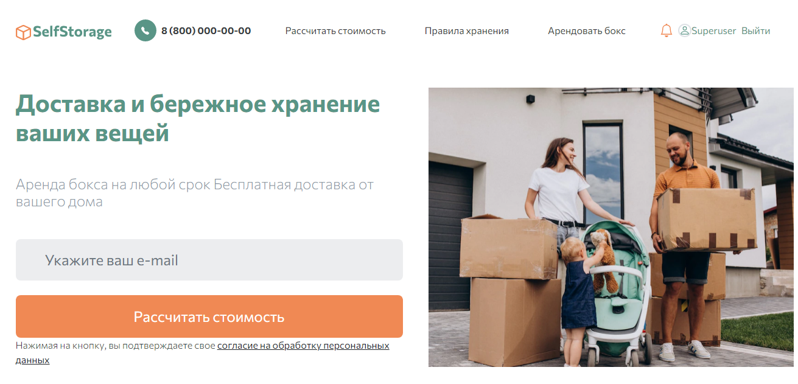

# Self storage

It is a Django-based website for a self storage service.
Key features:

- a user can authorize and work in his personal cabinet;
- a user can rent a box;
- a user can make a payment for the rent of the box on the site;
- if a user wants to take his belongings, he will receive a QR-code by email;
- if a rent term expires soon (or has already expired), a user will receive a notification email;
- it is possible to highlight the nearest storage in the storage list (the website can detect a user's geolocation).



## Prerequisites

Python 3.11 is required.

## Installation

- Download the project files.
- It is recommended to use [venv](https://docs.python.org/3/library/venv.html?highlight=venv#module-venv) for project isolation.
- Set up packages:

```bash
pip install -r requirements.txt
```

- Set up environmental variables in your operating system or in the .env file. The variables are:

  - `DEBUG` - a boolean that turns on/off debug mode (optional, `False` by default);
  - `SECRET_KEY` - a secret key for a particular Django installation (obligatory);
  - `ALLOWED_HOSTS` - a list of strings representing the host/domain names that this Django site can serve (obligatory when `DEBUG` is set to `False`);
  - `DATABASE` - a database address (optional, `db.sqlite3' in the root project folder by default), go [here](https://github.com/jacobian/dj-database-url) for more;
  - `LANGUAGE_CODE` a string representing the language code for this installation;
  - `CSRF_TRUSTED_ORIGINS` - a list of trusted origins for unsafe requests (obligatory), go [here](https://docs.djangoproject.com/en/4.1/ref/settings/#csrf-trusted-origins) for more;
  - `YA_API_KEY` - your YANDEX API key (obligatory, go to [the developer cabinet](https://developer.tech.yandex.ru/) for more);
  - `EMAIL_HOST_USER` - a username to use for the SMTP server (obligatory);
  - `EMAIL_HOST_PASSWORD` - a password to use for the SMTP server (obligatory);
  - `DEFAULT_FROM_EMAIL` - a default email address (optional if `EMAIL_HOST_USER` contains email address);
  - `NOTIFICATION_MAILING_INTERVAL_MINUTES` - an interval for mailing notifications, optional, `59` by default.
  - `SHOP_ID` - a shop_id for payment via youkassa
  - `API_KEY` - a api_key for payment via youkassa

To set up variables in .env file, create it in the root directory of the project and fill it up like this:

```bash
DEBUG=True
SECRET_KEY=REPLACE_ME
ALLOWED_HOSTS=localhost,127.0.0.1
DATABASE=db.sqlite3
LANGUAGE_CODE=ru-Ru
CSRF_TRUSTED_ORIGINS=http://127.0.0.1:8000/
YA_API_KEY=REPLACE_ME
EMAIL_HOST_USER=REPLACE_ME
EMAIL_HOST_PASSWORD=REPLACE_ME
DEFAULT_FROM_EMAIL=REPLACE_ME
NOTIFICATION_MAILING_INTERVAL_MINUTES=10
SHOP_ID=REPLACE_ME
API_KEY=REPLACE_ME

```

- Create SQLite database:

```bash
python manage.py migrate
```

- Create a superuser:

```bash
python manage.py createsuperuser
```

## Usage

- Run a development server:

```bash
python manage.py runserver
```

For sending mailing notifications by schedule, run:

```bash
python manage.py runapscheduler
```

- Go to [the admin site](http://127.0.0.1:8000/admin/) and fill the base;
- Go to [the home page](http://127.0.0.1:8000/).


## Production mode
* On the server, clone the repository to the /opt folder
* Add .env to the /opt/d_12_03_self_storage folder with the necessary variables

* Set the rights to run the deployment script
```chmod +x storage_docker.sh```
* Run the script
``./storage_docker.sh ``

* At the end of the deployment, the site works at the ip address of the server.
* SSL and domain are additionally configured manually

## Project goals

The project was created for educational purposes.
It's a group project for python and web developers at [Devman](https://dvmn.org).
